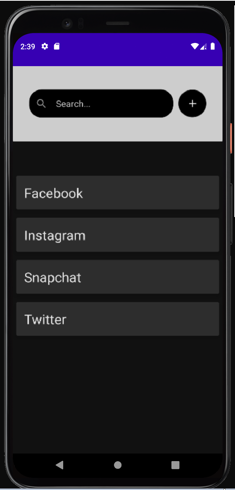
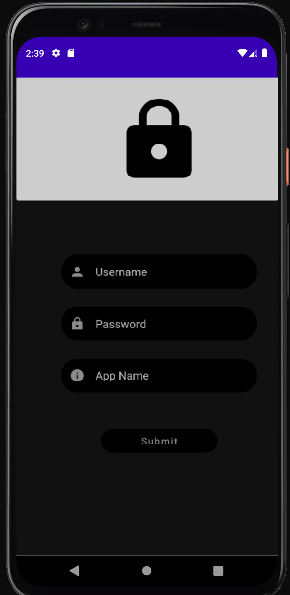
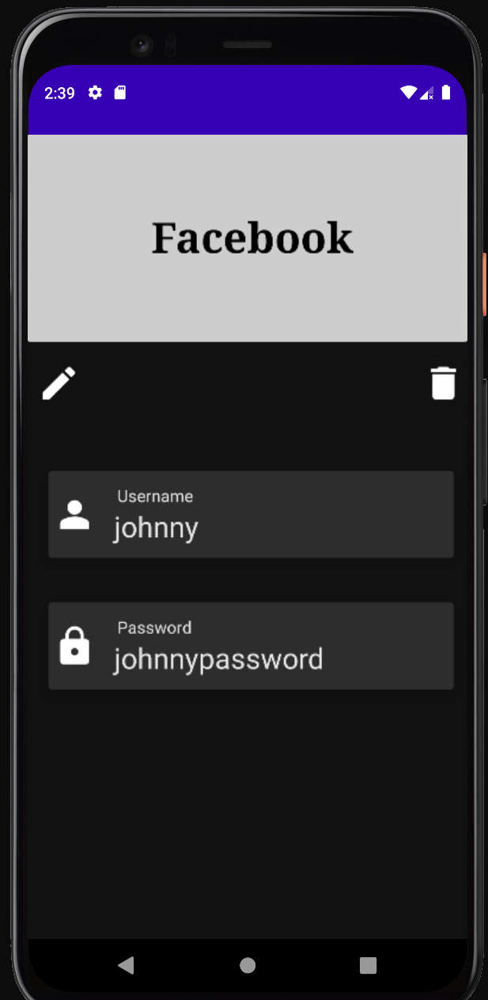
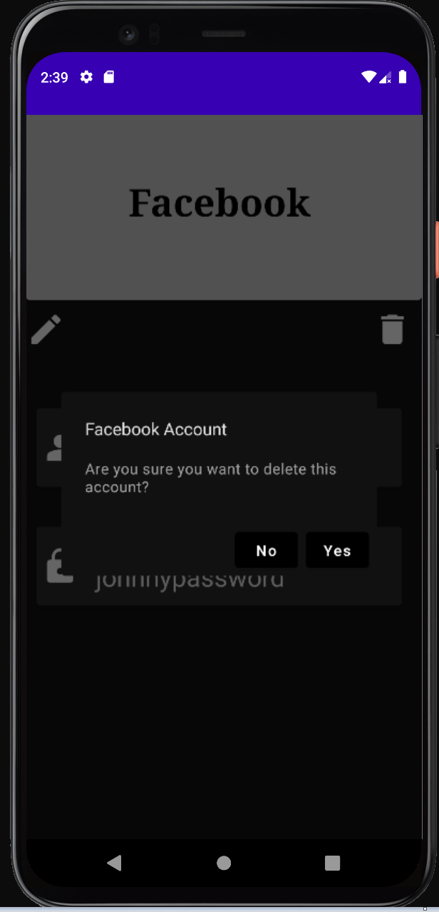

# Password Manager - Aplicatie mobila pentru gestiunea conturilor
## Obiective
Crearea unei aplicatii care sa se ocupe de gestionarea conturilor utilizatorului. Acesta va putea sa isi adauge conturile in apicatie, putand in cele din urma fie sa isi editeze conturile, fie sa le stearga.
## Partea tehnica
Este o aplicatie dezvoltata in Kotlin, avand in spate un server in Django cu o baza de date de tip PostgreSQL. Aplicatia functioneaza atat cu conexiune la internet, datele fiind persistate in baza de date a serverului, cat si fara conexiune la internet, fiind cache-uite pe dispozitivul mobil, iar in momentul in care dispozitivul are din nou internet, se va aplica o sincronizare a datelor de pe dispozitivul mobil pe server. 

## Flow
In momentul intrarii in aplicatie, utilizatorului ii este afisata o lista cu toate conturile pe care acesta le-a adaugat pana in momentul de fata.

  

De aici, utilizatorul are la dispozitie mai multe functionalitati:

- Functia de adaugare a unui cont - apsandu-se pe iconita de (+) din meniul principal.

  

- Functia de vizualizare a informatiilor a unui cont - apasandu-se pe unul din conturile din lista din meniul principal.

  

- Functia de modificare a informatiilor a unui cont - apasandu-se pe iconita de editare din sectiunea de informatii a unui cont.

  

- Functia de stergere a unui cont - apasandu-se pe iconita de stergere din sectiunea de informatii a unui cont.

